# Signature Maker Plugin for IDA Pro 9.0+

 [](https://github.com/mahmoudimus/ida-sigmaker/actions/workflows/python.yml)

An IDA Pro 9.0+ zero-dependency cross-platform signature maker plugin with optional SIMD (e.g. AVX2/NEON/SSE2) speedups that works on MacOS/Linux/Windows. The primary goal of this plugin is to work with future versions of IDA without needing to compile against the IDA SDK as well as to allow for easier community contributions.

Background reading on [mahmoudimus.com](https://mahmoudimus.com):

- [IDA Pro and Cython: super-charging the work-horse of reverse engineering](https://mahmoudimus.com/blog/2025/08/ida-pro-and-cython-super-charging-the-work-horse-of-reverse-engineering/): how the optional SIMD speedups were built.
- [Growing a unique function signature without rescanning the binary](https://mahmoudimus.com/blog/2026/05/growing-a-unique-function-signature-without-rescanning-the-binary/): the search algorithm, with interactive visualizations.
- [How do you know your Cython hot loop is fast enough?](https://mahmoudimus.com/blog/2026/05/how-do-you-know-your-cython-hot-loop-is-fast-enough/): how I confirmed those kernels are already optimal (memory-bound, not compute-bound).

## Table of contents

- [Installation](#installation)
  - [Quick Install](#quick-install)
  - [From Releases](#from-releases)
  - [Install with hcli](#install-with-hcli)
  - [Need to find your plugin directory?](#need-to-find-your-plugin-directory)
  - [Where and what is my default user directory?](#where-and-what-is-my-default-user-directory)
- [SIMD Speedups](#simd-speedups)
- [Requirements](#requirements)
- [What is a "sigmaker"?](#what-is-a-sigmaker)
- [Usage](#usage)
  - [Finding XREFs](#finding-xrefs)
  - [Signature searching](#signature-searching)
  - [Signature Configuration](#signature-configuration)
- [Performance](#performance)
  - [Benchmarks](#benchmarks)
  - [How it works](#how-it-works)
- [Using SigMaker as a library](#using-sigmaker-as-a-library)
  - [Batch search API](#batch-search-api)
  - [Custom batch search formatters](#custom-batch-search-formatters)
  - [Stability contract](#stability-contract)
  - [Used by](#used-by)
- [Acknowledgements](#acknowledgements)
- [Development & Releases](#development--releases)
  - [Contributing](#contributing)
- [Contact](#contact)

## Installation

sigmaker's main value proposition is its cross-platform (Windows, macOS, Linux) Python 3 support. It uses zero third party dependencies, making the code both portable and easy to install.

### Quick Install

- Copy [`src/sigmaker/__init__.py`](./src/sigmaker/__init__.py) into the /plugins/ folder to the plugin directory!
- Rename it to `sigmaker.py`
- *OPTIONALLY*, if you would like `SIMD` speedups, just `pip install sigmaker`
- Restart IDA Pro.

### From Releases

- Download the latest conveniently renamed `sigmaker.py` release from the [Releases page](https://github.com/mahmoudimus/ida-sigmaker/releases)
- Copy it to your IDA Pro plugins directory
- *OPTIONALLY*, if you would like `SIMD` speedups, just `pip install sigmaker`
- Restart IDA Pro

That's it!

### Install with hcli

[`hcli`](https://hcli.docs.hex-rays.com/) is Hex-Rays' command-line tool, and it can install sigmaker from the IDA Plugin Repository. Install `hcli` once:

```bash
curl -LsSf https://hcli.docs.hex-rays.com/install | sh        # macOS/Linux
iwr -useb https://hcli.docs.hex-rays.com/install.ps1 | iex    # Windows (PowerShell)
```

Then authenticate (see the [hcli docs](https://hcli.docs.hex-rays.com/)) and install the plugin:

```bash
hcli plugin search sigmaker
hcli plugin install SigMaker
```

`hcli` downloads the plugin and places it in `$IDAUSR/plugins` (`~/.idapro/plugins` on macOS/Linux), where IDA loads it on the next launch. Requires IDA 9.0+. For `SIMD` speedups, also run `pip install sigmaker` as above.

### Need to find your plugin directory?

From IDA's Python console run the following command to find its plugin directory:

```python
import idaapi, os; print(os.path.join(idaapi.get_user_idadir(), "plugins"))
```

### Where and what is my default user directory?

The user directory is a location where IDA stores some of the global settings and which can be used for some additional customization.
Default location:

- On Windows: `%APPDATA%/Hex-Rays/IDA Pro`
- On Linux and Mac: `$HOME/.idapro`

## SIMD Speedups

If you just followed the installation above and ran `pip install sigmaker`, then based on your system and architecture (i.e. Windows (x64), Linux (x64), Mac (x64), Mac (ARM/Silicon)), the plugin will install the appropriate wheel and will automatically use them if they're available. You do not have to do anything else. The plugin is designed to display the status of whether or not SIMD speedups are installed. They are shown in the top right menu bar of the plugin:

### SIMD Enabled

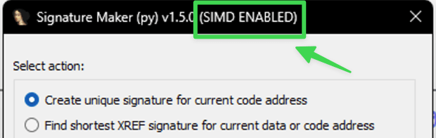

### No SIMD Speedups

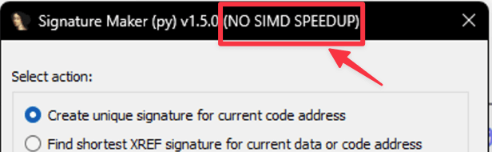

## Requirements

- IDA Pro 9.0+
- IDA Python
- Python 3.10+

## What is a "sigmaker"?

Sigmaker stands for "signature maker." It enables users to create unique binary pattern signatures that can identify specific addresses or routines within a binary, even after the binary has been updated.

In malware analysis or binary reverse engineering, a common challenge is pinpointing an important address, such as a function or global variable. However, when the binary is updated, all the effort spent identifying these locations can be lost if their addresses change.

To preserve this work, reverse engineers take advantage of the fact that most programs do not change drastically between updates. While some functions or data may be modified, much of the binary remains the same. Most often, previously identified addresses are simply relocated. This is where `sigmaker` comes in.

Sigmaker lets you create unique patterns to track important parts of a program, making your analysis more resilient to updates. By generating signatures for specific functions, data references, or other critical locations, you can quickly relocate these points in a new version of the binary, saving time and effort in future reverse engineering tasks.

## Usage

In disassembly view, select a line you want to generate a signature for, and press
**CTRL+ALT+S**:
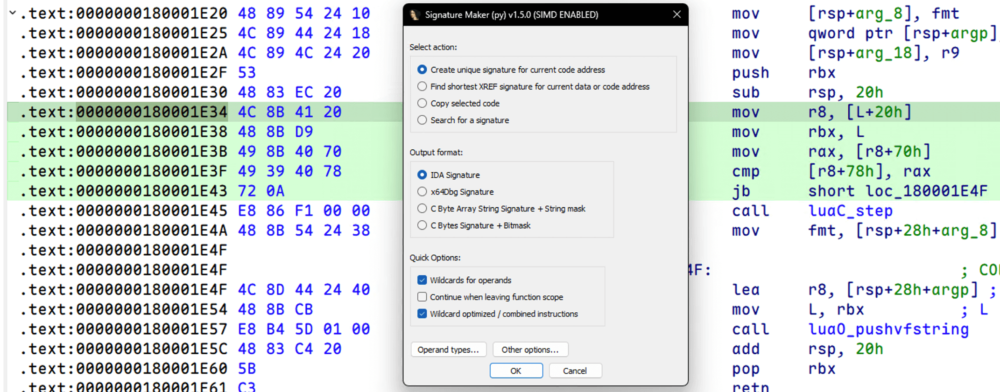

*OR* *Right-Click* and select *SigMaker*:
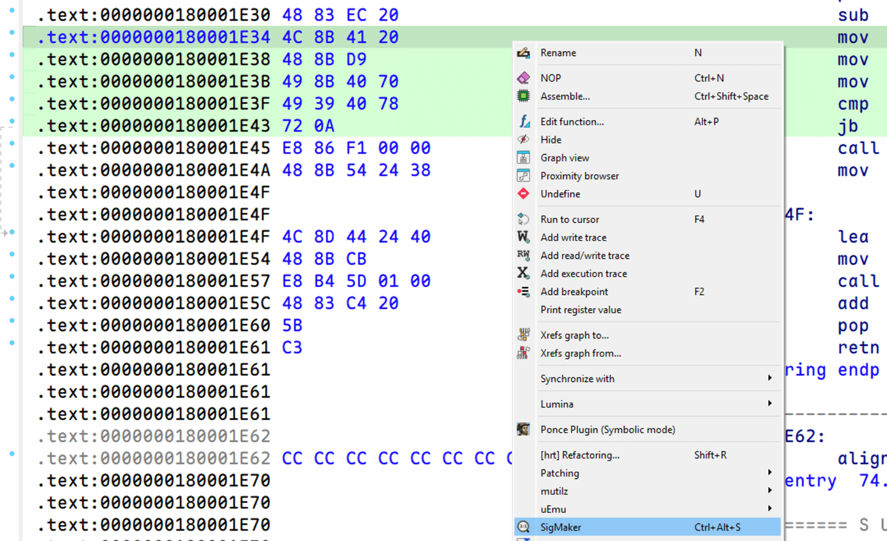

The generated signature will be printed to the output console, **as well as copied to the clipboard**:
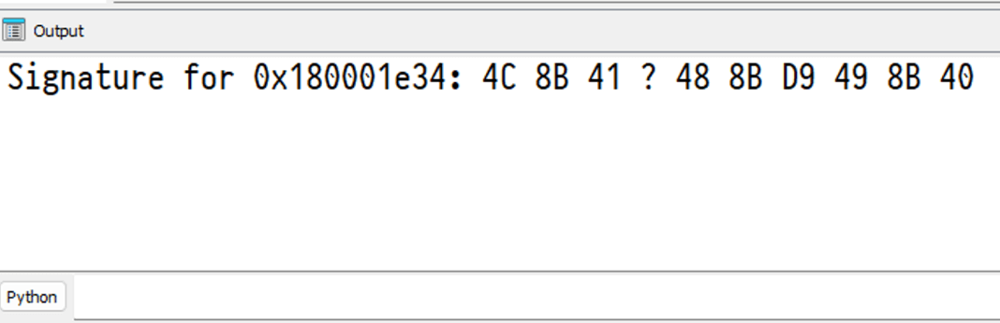

___

| Signature type | Example preview |
| --- | ----------- |
| IDA Signature | `E8 ? ? ? ? 45 33 F6 66 44 89 34 33` |
| x64Dbg Signature | `E8 ?? ?? ?? ?? 45 33 F6 66 44 89 34 33` |
| C Byte Array Signature + String mask | `\xE8\x00\x00\x00\x00\x45\x33\xF6\x66\x44\x89\x34\x33 x????xxxxxxxx` |
| C Raw Bytes Signature + Bitmask | `0xE8, 0x00, 0x00, 0x00, 0x00, 0x45, 0x33, 0xF6, 0x66, 0x44, 0x89, 0x34, 0x33  0b1111111100001` |

___

### Finding XREFs

Generating code Signatures by data or code xrefs and finding the shortest ones is also supported:
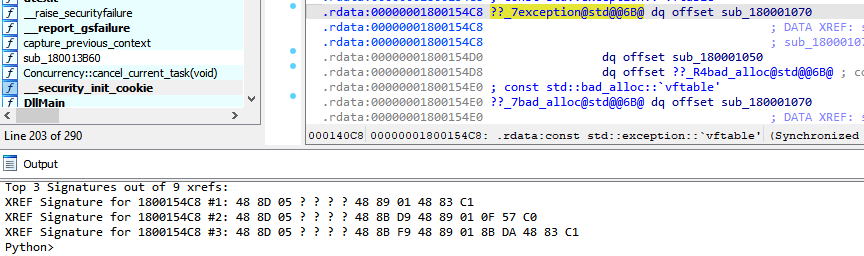

___

### Signature searching

Searching for Signatures works for supported formats:

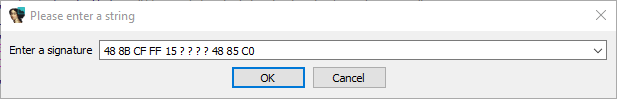

It also supports nibble wildcard searches such as `48 4? ?F 90`:

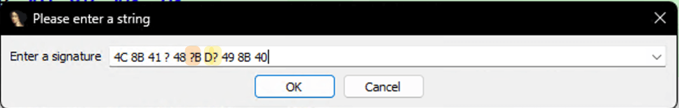

Nibble wildcard search works with or without the optional SIMD speedups. Without
the speedup wheel, SigMaker finds the longest exact-byte run with the standard
library's C-speed byte search and verifies the remaining nibble masks in Python.
The pattern must therefore contain at least one exact byte, and patterns whose
best exact run is very common can be substantially slower without SIMD.

Just enter any string containing your Signature, it will automatically try to figure out what kind of Signature format is being used:

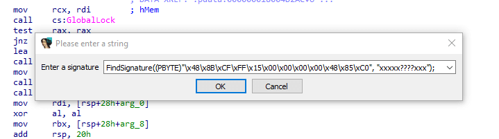

Currently, all output formats you can generate are supported.

Match(es) of your signature will be printed to console alongside the containing function name:

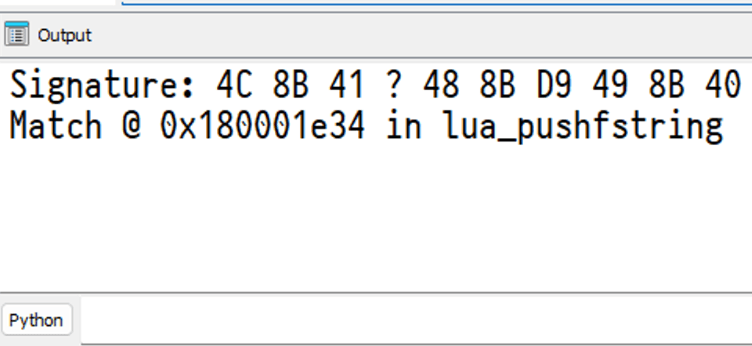

If the matched address is not a function name or has no function name, it falls back to just printing the address:

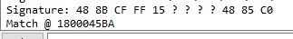

### Signature Configuration

`sigmaker` also supports configurable wildcardable operands for unique signature creation:

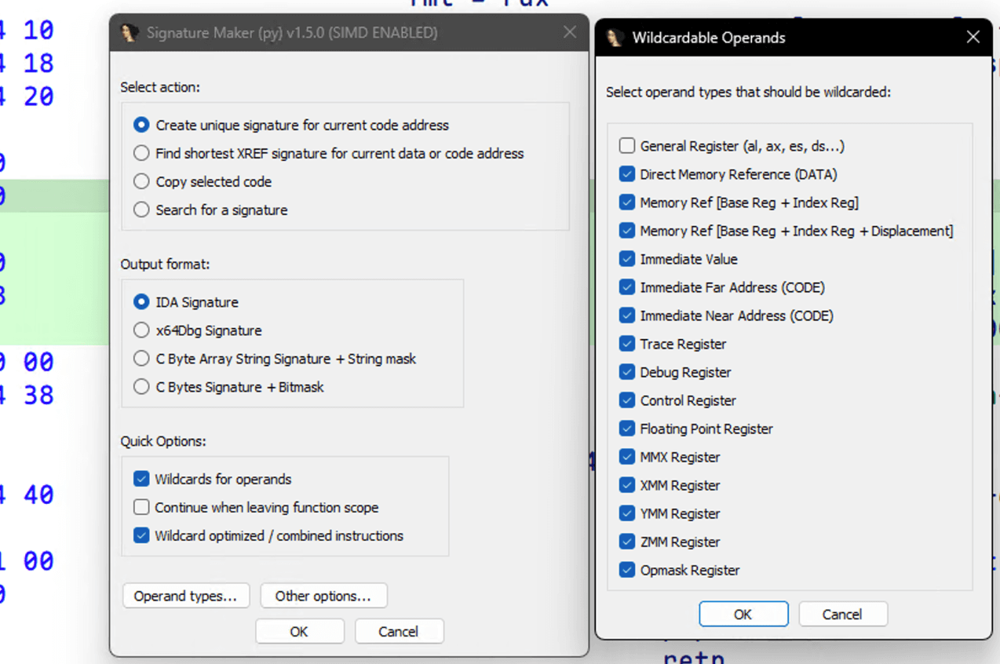

There are also various options that be configured via the `Other options` button:

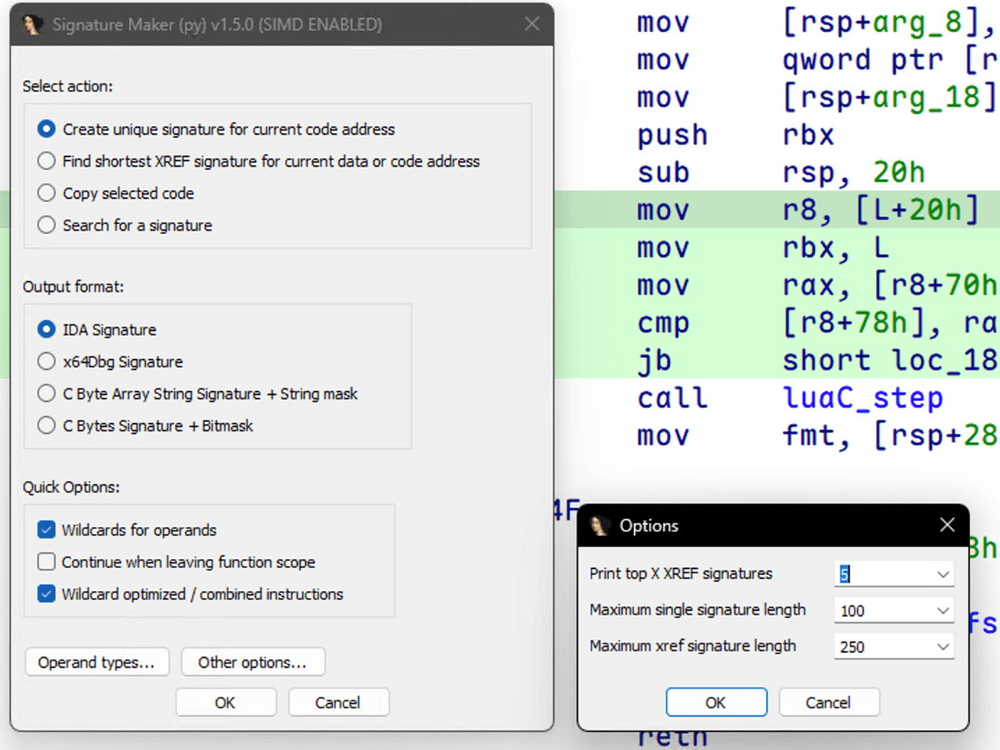

## Performance

SigMaker's "find the shortest unique signature for the current function" search has been heavily optimized. On a real 16 MB module, a single worst-case function search once took **462 seconds (7.7 minutes)**. A stack of four optimizations brought the heaviest searches down to the tens-of-seconds range and typical ones to near-instant. One user [reported](https://github.com/mahmoudimus/ida-sigmaker/issues/27#issuecomment-4577775008) the progress wait-box now "barely show[s] up for a 26 byte signature."

The full derivation, including the match-set math, the counting-sort index, the selectivity proof, and what is novel about the approach, is written up in **[ALGORITHM.md](./ALGORITHM.md)**.

### Benchmarks

Measured on the largest function (8486 bytes) of a 16 MB module via native idalib on Apple Silicon. The effects are cumulative across the four phases:

| Optimization | Effect | PR |
| --- | --- | --- |
| Phase 1: seed-then-refine candidate refinement | ~13x faster function search | [#33](https://github.com/mahmoudimus/ida-sigmaker/pull/33) |
| Phase 2: 2-byte bucket position index | additional ~2.48x on large databases, widening as the database grows | [#35](https://github.com/mahmoudimus/ida-sigmaker/pull/35) |
| Phase 3: dynamic seed selection (1- or 2-byte) | per-anchor seed scans cut from 206 to 2 | [#36](https://github.com/mahmoudimus/ida-sigmaker/pull/36) |
| Phase 4: Cython in-place refinement | per-byte refinement ~14 s to ~0.28 s (~50x); function total ~24 s to ~15.6 s | [#36](https://github.com/mahmoudimus/ida-sigmaker/pull/36) |

Signature output is byte-identical before and after every optimization. The test suite cross-checks each fast path against a brute-force oracle and diffs the generated signatures across the entire test binary.

### How it works

A short tour (see [ALGORITHM.md](./ALGORITHM.md) for the math):

- **Seed, then refine.** The set of database matches can only shrink as a signature grows, so instead of rescanning the whole database for every candidate length, SigMaker scans once to seed a candidate set and then filters that set in place as each byte is appended.
- **Index the database once.** A counting-sort index over every adjacent byte pair lets the seed be drawn from the *rarest* exact run in the pattern, in time proportional to that run's frequency rather than to the database size. The same index serves both 1-byte and 2-byte runs for free, so the most selective anchor is always chosen.
- **Push the hot loops into C.** With the optional `pip install sigmaker` SIMD wheel, the index build and the per-byte refinement run as `nogil` C over typed buffers with zero per-call allocation, and the raw byte scan uses AVX2/NEON/SSE2. Without the wheel, pure-Python fallbacks produce identical results.

## Using SigMaker as a library

Beyond the IDA plugin, `sigmaker` is imported directly as a Python library by other tools (for example, batch signature-generation pipelines). The core types are usable from any IDAPython or idalib context:

```python
import sigmaker

cfg = sigmaker.SigMakerConfig(
    output_format=sigmaker.SignatureType.IDA,
    wildcard_operands=True,
    continue_outside_of_function=False,
    wildcard_optimized=True,
    ask_longer_signature=False,
)
result = sigmaker.SignatureMaker().make_signature(ea, cfg)
print(f"{result.signature:ida}")   # IDA-style string
print(len(result.signature))       # byte length

# Cross-references:
xrefs = sigmaker.XrefFinder().find_xrefs(ea, cfg)
for gen in xrefs.signatures:
    print(str(gen.address), f"{gen.signature:ida}")
```

### Batch search API

#### Why batch search?

Signatures are usually maintained as a collection. After a binary update, you
need to know which patterns still match, which became ambiguous, and which no
longer match. Searching each pattern separately repeats scan setup and leaves
you to compare the results by hand. Batch search accepts the collection once
and returns one result per pattern in input order.

The batch layer adds little overhead:

- A current profile of `BatchSignatureSearcher.from_text()` parsed a 5,003-line
  mixed paste into 5,000 entries in 16.0 ms median, or roughly 312,000 entries
  per second.
- The requested segment buffer is loaded once and reused for every unique
  normalized pattern. This design follows real-binary profiling of signature
  generation where loading segments before every uniqueness check consumed 84%
  of total generation time.
- Duplicate normalized patterns share their match results, and file offsets are
  resolved only when a caller or formatter requests them. A performance
  [regression test](./tests/performance_test.py) constructs a 100,000-hit batch
  result while asserting that search performs no file-offset lookups.

These are focused measurements of parsing, scan setup, and result construction.
End-to-end search time still depends on the binary, search scope, patterns, and
whether SIMD speedups are available.

#### Search a batch

Batch search is available to IDAPython and idalib scripts:

```python
import sigmaker

text = """
print = "48 8B ?? ??"
update := E8 ? ? ? ? 48 89 C7
tick = 90;90;CC
draw = "48 89 C7"
48 8B ?? ?? 89
"""

results = sigmaker.BatchSignatureSearcher.from_text(text).search()
print(results)            # text
print(f"{results:text}")  # registered text formatter
print(f"{results:csv}")   # registered CSV formatter
print(f"{results:json}")  # registered JSON formatter

for result in results:
    print(result.display_name, result.status, result.match_count)
    print(result.raw_pattern, result.search_pattern, result.normalized_signature)
    for hit in result.matches:
        file_offset = result.file_offset_for_match(hit)
        file_offset_text = (
            "unavailable" if file_offset is None else f"0x{file_offset:X}"
        )
        print(f"{hit:ea}", f"{hit:rva}", file_offset_text)
```

#### Input format

Each non-empty line is one signature:

- **Unnamed pattern:** Write the pattern by itself. The result is labeled with
  its source line.
- **Named pattern:** Use `name := pattern` or `name = pattern`.
- **Quoted pattern:** Quotes are accepted only around the right-hand side of a
  named pattern, as in `update = "E8 ? ? ? ? 48"`.
- **Comments:** `#` and `//` comments are ignored outside quoted strings.
  Markdown fence lines are also skipped, which makes snippets from issues and
  notes safe to paste.
- **Entry boundary:** Only a newline starts a new entry. A semicolon remains a
  byte separator, so `tick := 90;90;CC` is one signature.
- **Source text:** SigMaker does not parse declarations, infer signatures from
  prose, or join a signature across multiple lines.

`SignatureSearcher.from_many(text)` returns the parsed per-pattern searchers if
you need to inspect names and source lines before searching.
`BatchSignatureSearcher.from_text(text)` uses it internally.

Each line uses the same strict parser as regular signature search. Supported
forms include:

```text
48 8B ? ?? 4? ?F
488B??9090
488B4??F90
48,8B;?;90
\x48\x8B\x00\x48\x89 xx?xx
0x48, 0x8B, 0x00, 0x48, 0x89 0b11011
(48 8B ? 90)
```

Compact input may omit separators only when the complete pattern consists of
two-character cells: `HH`, `??`, `H?`, or `?H`. For example, `488B??9090`
parses as `48 8B ? 90 90`.

The strict parser rejects ambiguous input instead of guessing:

- Single nibbles, such as `E 8 4`.
- Odd-length compact input, such as `488B?9090`.
- Input that mixes glued and separated cells, such as `488B ?? 90`.
- Long integer notation, such as `0x488B9090`.
- Colon, pipe, or hyphen separators.
- Declaration text and random prose.

An invalid pattern becomes an error on that entry; it does not abort the rest
of the batch. Every searchable pattern must contain at least one exact byte.
An all-wildcard pattern such as `?? ?? ??` is rejected because it matches almost
everywhere and is not a useful search key.

#### Results

`BatchSearchResults` is iterable and preserves input order. `list(results)`
returns the per-pattern `SearchResults` objects. Each entry contains:

- **Identity and input**
  - `name` and `source_line` identify the entry.
  - `raw_pattern` contains the extracted user input.
- **Parsed patterns**
  - `search_pattern` is the parsed SigMaker pattern used for display.
  - `normalized_signature` is the canonical matcher and cache pattern.
  - `signature_str` remains a compatibility alias for `search_pattern`.
- **Outcome**
  - `status` is `matched`, `no_matches`, or `error`.
  - `matches` is the list of matching addresses.
  - `error` contains the per-entry failure, when present.

Nibble masks such as `4?` and `?F` are preserved in both parsed and normalized
patterns. A full-byte wildcard displays as `?` in `search_pattern` and as `??`
in `normalized_signature`.

#### Match addresses and offsets

Each `Match` still behaves like an `int`, so existing address-based code keeps
working. It also carries optional RVA and file-offset metadata and supports:

- `f"{hit:ea}"` for the absolute effective address.
- `f"{hit:rva}"` for the module-relative virtual address.
- `f"{hit:fileoffset}"` for the input-file offset.

Search populates the RVA directly. File offsets are lazy because IDA resolves
them one address at a time. Call `result.file_offset_for_match(hit)`, or let a
formatter resolve the hits it emits. Each result caches both successful and
unavailable lookups.

Batch search itself performs no file-offset lookups. The text formatter resolves
only previewed hits; CSV and JSON resolve every exported hit. `:rva` and
`:fileoffset` do not fall back to `:ea`, since that would label an absolute
address as a derived offset. When the requested metadata is absent from the
`Match`, formatting returns `repr(hit)`, which still includes the effective
address.

#### Scope, buffer reuse, and cancellation

- With SIMD speedups, a batch lazily copies the requested segment or all
  segments once, then reuses that buffer for every unique normalized pattern.
- Without SIMD speedups, nibble wildcard patterns use the same shared-buffer
  path. Ordinary IDA-compatible patterns continue through IDA's native search.
- `batch.search(scope_ea=ea)` limits the scan to the containing segment, using
  the same fallback policy as ordinary signature search.
- A caller may pass a preloaded `buf`. Supplying both `buf` and `scope_ea` is
  rejected because SigMaker cannot prove that the buffer represents that
  segment.
- Canceling a batch raises `UserCanceledError`. Partial hits are not cached or
  exported as a completed entry.

#### GUI and headless embedding

`SignatureSearcher` and `BatchSignatureSearcher` select their default services
once from the host:

| Host | Search progress and cancellation |
| --- | --- |
| Graphical IDA (`idaapi.is_idaq() is True`) | IDA wait box and Cancel button |
| idalib | Headless no-op services |
| Missing or failed `is_idaq()` probe | Headless no-op services |

The interactive plugin also installs IDA-backed services explicitly while it
runs an action. Direct calls from IDAPython therefore retain their existing UI,
while idalib and stripped embedders do not call `idaapi.user_cancelled()`.

Under idalib, no search-specific configuration is required. Initialize IDA
before importing SigMaker, then use the same search API:

```python
import idapro
import sigmaker

results = sigmaker.BatchSignatureSearcher.from_text(text).search()
```

To force headless search even inside graphical IDA, scope an empty service set
to the operation:

```python
with sigmaker.UIServices.use(sigmaker.UIServices()):
    results = sigmaker.BatchSignatureSearcher.from_text(text).search()
```

An embedder may instead provide its own progress context or cancellation
predicate. The predicate is resolved once before each scan loop and polled at
the existing cancellation stride, so injection does not add a context lookup
to every match:

```python
services = sigmaker.UIServices(
    cancel_requested=cancel_event.is_set,
)

with sigmaker.UIServices.use(services):
    results = sigmaker.BatchSignatureSearcher.from_text(text).search()
```

`progress` is any callable that accepts the progress message and returns a
context manager. Within an explicitly constructed `UIServices`, omitted fields
use their headless no-op defaults.

`UIServices` isolates search-side UI behavior. It does not remove the plugin's
Form, action, or menu classes from the full module; producing a distributable
engine-only source file remains a separate packaging concern.

#### Display and export

`str(results)` and `f"{results:text}"` use the human-readable text formatter.
`BatchSearchResults.display()` writes that format to `idaapi.msg` by default, or
writes any selected formatter to a text file-like object or callable sink:

```python
import io

buf = io.StringIO()
results.display(output=buf, formatter="json")
payload = buf.getvalue()
```

The built-in formats are:

- `text` and `.txt` for a human-readable summary with a bounded match preview.
- `csv` and `.csv` for spreadsheets and line-oriented tooling.
- `json` and `.json` for structured interchange.

The built-ins intentionally stop at common interchange formats. Project-specific
layouts belong in registered formatters, so a team can decide how to name
symbols, handle ambiguous matches, and emit EAs, RVAs, or file offsets without
changing SigMaker core. Loadable examples live in [`examples/`](./examples/).

### Custom batch search formatters

Output conventions vary between reverse-engineering projects. One project may
need debugger labels, another C declarations, and another a module-relative map
for a loader. The formatter registry lets those conventions remain local while
still supporting `results.format(...)`, f-strings, `display()`, and suffix-based
file export.

Register a formatter with a name and any file suffixes it owns:

```python
import sigmaker


@sigmaker.BatchSearchFormatter.register("labels", suffixes=(".labels",))
class LabelFormatter:
    def format(self, results: sigmaker.BatchSearchResults) -> str:
        lines = []
        for result in results:
            if len(result.matches) != 1:
                continue
            name = result.name or result.display_name
            hit = result.matches[0]
            address = f"{hit:rva}" if hit.rva is not None else f"{hit:ea}"
            lines.append(f"{name}: {address}")
        return "\n".join(lines) + "\n"
```

After registration, `results.format("labels")` and `f"{results:labels}"` use the
formatter by name. Exporting to `something.labels` selects it by suffix.
Formatter classes are instantiated once at registration time; formatter objects
can be registered the same way.

#### Registration safety

Formatter registration guards existing behavior, including the built-in
`text`, `csv`, and `json` formats:

- Formatter names and export suffixes must be unique.
- A conflicting registration raises `ValueError` before either registry is
  changed. The error points to `override=True` when replacement is intentional.
- `override=True` is required to replace an existing name or rebind an existing
  suffix:

```python
@sigmaker.BatchSearchFormatter.register(
    "labels",
    suffixes=(".labels",),
    override=True,
)
class ReplacementLabelFormatter:
    ...
```

One `override=True` covers both the formatter name and its listed suffixes.
Existing suffixes that already point to a replaced name remain valid. This
makes replacement explicit without silently disconnecting other suffixes.

#### Loading personal formatters

To install a formatter permanently, paste its registration code into
`$IDAUSR/idapythonrc.py`. IDA sources that file during startup, so personal and
project-specific formats are available in each new IDA session.

If `sigmaker` is not already importable from your IDA Python environment, add
the SigMaker plugin directory to `sys.path` before the formatter code.

See
[`examples/batch_search_c_formatter.py`](./examples/batch_search_c_formatter.py)
for a complete C-style formatter template that emits absolute EAs, RVAs, and
file offsets while keeping C output out of the built-in format list.

### Stability contract

If you embed `sigmaker`, you can rely on the following. These guarantees are
checked before any change to the public surface:

- **Append-only configuration**
  - `SigMakerConfig` fields are never reordered or removed.
  - New behavior arrives as new fields with safe defaults, so existing
    constructions keep working.

- **Stable public names**
  - Signature generation
    - `SignatureMaker`
    - `SigMakerConfig`
    - `SignatureType`
      - Stable members: `IDA`, `x64Dbg`, `Mask`, and `BitMask`.
    - `Signature`
      - Stable behavior: `__len__` and `__format__`.
    - `GeneratedSignature`
      - Stable attributes: `signature`, `address`, `status`, and `match_count`.
    - `GenerationPolicy`
    - `GenerationStatus`
  - Cross-reference generation
    - `XrefFinder`
    - `XrefGeneratedSignature`
      - Stable attribute: `signatures`.
  - Signature search
    - `SignatureSearcher`
      - Stable attributes: `input_signature`, `name`, and `source_line`.
    - `SearchResults`
      - Stable attributes: `matches`, `signature_str`, `raw_pattern`,
        `search_pattern`, and `normalized_signature`.
      - Stable method: `file_offset_for_match`.
    - `Match`
      - Stable attributes: `address`, `rva`, and `file_offset`.
      - `__str__` returns the hexadecimal address.
      - `__format__` supports `ea`, `rva`, and `fileoffset`.
    - `UIServices`
      - Stable attributes: `progress` and `cancel_requested`.
      - `current()` returns the services active in the current context.
      - `use(services)` scopes services to one context and restores the
        previous value on exit.
  - Batch search
    - `BatchSignatureSearcher`
      - Stable attributes: `input_text` and `searchers`.
    - `BatchSearchResults`
      - Stable behavior: `__str__` and `__format__`.
    - `BatchSearchFormatter`

- **Stable method signatures**
  - Signature generation
    - `SignatureMaker.make_signature(ea, cfg, end=None, *, progress_reporter=None, policy=GenerationPolicy.strict())`
  - Cross-reference generation
    - `XrefFinder.find_xrefs(ea, cfg)`
    - `XrefFinder.count_code_xrefs_to(ea)`
    - `XrefFinder.iter_code_xrefs_to(ea)`
  - Signature search
    - `SignatureSearcher.from_signature(input_signature, *, name=None, source_line=0)`
    - `SignatureSearcher.from_many(text)`
    - `UIServices.current()`
    - `UIServices.use(services)`
  - Batch search
    - `BatchSignatureSearcher.search(*, buf=None, scope_ea=None)`

- **Stable format specifications**
  - Signature formats keep producing their current output exactly:
    - `f"{sig:ida}"`
    - `f"{sig:x64dbg}"`
    - `f"{sig:mask}"`
    - `f"{sig:bitmask}"`
  - Batch search keeps the registered built-in formatter names:
    - `text`
    - `csv`
    - `json`

- **Byte-identical defaults**
  - Production defaults are unchanged across optimizations.
  - A script that does not opt into a new flag gets byte-identical signatures
    to previous versions.

### Used by

Projects that build on or embed the `sigmaker` library:

- [mrexodia/ida-pro-mcp](https://github.com/mrexodia/ida-pro-mcp), an AI reverse-engineering MCP server (8.9k+ stars), vendors a stripped, engine-only copy of `sigmaker` and exposes signature tools through `SigMakerConfig`, `SignatureType`, `SignatureMaker().make_signature`, and `XrefFinder().find_xrefs`.
- [koyzdev/sigdrift](https://github.com/koyzdev/sigdrift) is a batch signature-generation script that imports the library and calls `SignatureMaker().make_signature(ea, SigMakerConfig(...))` and `XrefFinder()`, formatting results via `f"{sig:ida}"` and `f"{sig:mask}"`.

Building something on top of `sigmaker`? Open a PR or an issue and I will add it here.

## Acknowledgements

Thank you to [@A200K](https://github.com/A200K)'s [IDA-Pro-SigMaker](https://github.com/A200K/IDA-Pro-SigMaker) plugin, which served as inspiration and the basis for the initial port of this plugin. I would also like to acknowledge [@kweatherman](https://github.com/kweatherman)'s [sigmakerex](https://github.com/kweatherman/sigmakerex) as independent prior work within the SigMaker ecosystem. While the initial port did not draw from sigmakerex, members of the community later requested compatibility and feature parity with parts of its functionality (for example, see [issue #17](https://github.com/mahmoudimus/ida-sigmaker/issues/17)). As documented in [sigmakerex's README credits](https://github.com/kweatherman/sigmakerex#credits), there is a long history of SigMaker authors and contributors, and I would like to thank and acknowledge them as well:

> thanks to the previous creators of the original SigMaker tool back from the gamedeception.net days up to the current C/C++ and Python iteration authors:
> P4TR!CK, bobbysing, xero|hawk, ajkhoury, and zoomgod et al.
>
> Thanks to Wojciech Mula for his SIMD programming resources.

## Development & Releases

### Contributing

1. Fork the repository
2. Create a feature branch
3. Make your changes
4. Test thoroughly
5. Submit a pull request

The version lives in one place, `__version__` in `src/sigmaker/__init__.py`. To keep `ida-plugin.json` in step with it automatically, enable the repo's git hook once per clone:

```bash
git config core.hooksPath .githooks
```

The pre-commit hook (`.githooks/pre-commit`) runs `tools/sync_plugin_version.py`, which copies `__version__` into `ida-plugin.json` and stages it, so the manifest the IDA Plugin Repository reads can never drift behind a version bump. CI runs the same check (`TestPluginManifestVersion`) as a backstop for commits that skip the hook.

## Contact

ping me on x [@mahmoudimus](https://x.com/mahmoudimus) or you may contact me from any one of the addresses on [mahmoudimus.com](https://mahmoudimus.com).
